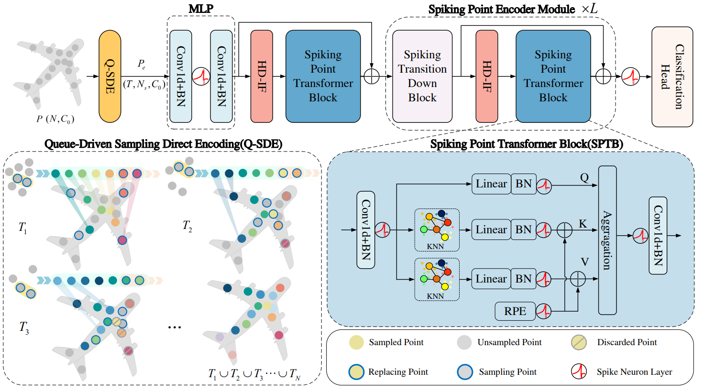

# Spiking Point Transformer (AAAI 2025)



Official PyTorch implementation of [Spiking Point Transformer for Point Cloud Classification](https://arxiv.org/pdf/2502.15811).

## Data preparation

Place the datasets under `data/` (symlinks to existing datasets also work):

```text
data/
├── modelnet40_normal_resampled/
│   ├── modelnet10_{shape_names,train,test}.txt
│   ├── modelnet40_{shape_names,train,test}.txt
│   └── <class>/<shape_id>.txt
└── ScanObjectNN/
    └── main_split/
        ├── training_objectdataset_augmentedrot_scale75.h5
        └── test_objectdataset_augmentedrot_scale75.h5
```

[ModelNet data](https://shapenet.cs.stanford.edu/media/modelnet40_normal_resampled.zip) supplies XYZ coordinates and normals. ModelNet10 uses its own split lists and ten classes. ScanObjectNN uses the full PB_T50_RS split **with background**, not `main_split_nobg`. Dataset paths can be overridden with `dataset.DATA_PATH=/path/to/data`.

## Installation

Use Linux, Python 3.9, PyTorch 2.1.2, CUDA 12.1, CuPy 12.3.0 and NumPy 1.26.4. Building the CUDA extensions requires the CUDA toolkit with `nvcc` and a GNU C++ compiler. Set `CUDA_HOME` to the toolkit directory and add its `bin` directory to `PATH`.

The commands below target H800 (compute capability 9.0). Set `TORCH_CUDA_ARCH_LIST` to the appropriate architecture for another GPU.

```sh
python -m pip install setuptools==75.9.1 ninja==1.11.1.4
python -m pip install torch==2.1.2 --index-url https://download.pytorch.org/whl/cu121
python -m pip install -r requirements.txt
cd ops/fps
TORCH_CUDA_ARCH_LIST=9.0 python setup.py install
cd ../..
```

Install the PointNet2 CUDA operators from [Pointnet2_PyTorch](https://github.com/erikwijmans/Pointnet2_PyTorch), using the pinned revision and the same GPU architecture:

```sh
git clone https://github.com/erikwijmans/Pointnet2_PyTorch.git ../Pointnet2_PyTorch
git -C ../Pointnet2_PyTorch checkout b5ceb6d9ca0467ea34beb81023f96ee82228f626
sed -i 's/os.environ\["TORCH_CUDA_ARCH_LIST"\] = .*/os.environ.setdefault("TORCH_CUDA_ARCH_LIST", "9.0")/' ../Pointnet2_PyTorch/pointnet2_ops_lib/setup.py ../Pointnet2_PyTorch/pointnet2_ops_lib/pointnet2_ops/pointnet2_utils.py
TORCH_CUDA_ARCH_LIST=9.0 pip install --no-build-isolation ../Pointnet2_PyTorch/pointnet2_ops_lib
```

## Training

Use the dataset-specific configuration with one DDP process per GPU:

```sh
CUDA_VISIBLE_DEVICES=0,1 torchrun --standalone --nproc_per_node=2 train_cls.py --config-name modelnet10
CUDA_VISIBLE_DEVICES=0,1 torchrun --standalone --nproc_per_node=2 train_cls.py --config-name modelnet40
CUDA_VISIBLE_DEVICES=0,1,2,3 torchrun --standalone --nproc_per_node=4 train_cls.py --config-name scanobjectnn
```

`batch_size` is per GPU. The supplied configurations use these settings:

| Configuration | Q-SDE samples | GPUs | Batch per GPU | Learning rate | Weight decay | Point dropout | Scale range |
|---|---:|---:|---:|---:|---:|---:|---|
| `modelnet10` | 512 | 2 | 8 | 0.001 | 0.0005 | 0.5 | 0.8–1.25 |
| `modelnet40` | 768 | 2 | 8 | 0.001 | 0.0005 | 0.35 | 0.8–1.25 |
| `scanobjectnn` | 768 | 4 | 16 | 0.004 | 0.0001 | 0.2 | 0.85–1.15 |

All configurations use 1,024 input points, four time steps, AdamW and 200 epochs, with a learning-rate factor of 0.3 every 50 epochs. Override Q-SDE samples with `model.num_samples=512` or `model.num_samples=768`.

ModelNet10 enables training-only random point subsets through `dataset.random_points: true`. ModelNet40 uses fixed point subsets. ModelNet test inputs always use the first 1,024 points and include normals. ModelNet uses plain cross-entropy; ScanObjectNN uses label smoothing of 0.1 and class weights proportional to `(mean_class_count / class_count) ** 0.75`, normalized to mean 1 using training labels only. These training settings include adjustments to the paper's hyperparameters.

The model uses IF/LIF/EIF/PLIF experts, dense training gates and Top-2 inference gates. Multi-step membrane potentials initialize uniformly in `[0, 0.2)`. The hybrid output threshold is 0.2 and the expert thresholds are 0.5.

Training writes the actual configuration, per-epoch metrics and checkpoints under `logs/`. Checkpoints include model, optimizer and scheduler state, the epoch and measured accuracy. OA counts every test object once; mAcc averages per-class accuracies. Distributed evaluation does not pad or duplicate samples.

Training starts afresh and overwrites existing metrics and checkpoints in the selected run directory. To continue a run, explicitly pass `+resume=/path/to/last_model.pth`.

## Evaluation

Evaluate the saved model in a fresh process. The checkpoint determines the model dimensions and class count; the selected configuration supplies the data path.

```sh
CUDA_VISIBLE_DEVICES=0,1,2,3 torchrun --standalone --nproc_per_node=4 test_cls.py --config-name scanobjectnn +checkpoint=/path/to/best_model.pth
```

The default is **no voting**. Add `+vote_num=100` for a separate voting evaluation. `evaluation.json` records the checkpoint, model dimensions, vote count, test-set size, OA and mAcc. FPS and membrane initialization are stochastic, so repeated evaluations can vary.

Model exports contain `model.pth`, `config.yaml` and `training.log`. Use the model's configuration and GPU count when evaluating it. Checkpoints and datasets are not included in Git.

## Citation
If you find this work useful, please consider citing:
```bibtex
@article{wu2025spiking,
  title={Spiking Point Transformer for Point Cloud Classification},
  author={Wu, Peixi and Chai, Bosong and Li, Hebei and Zheng, Menghua and Peng, Yansong and Wang, Zeyu and Nie, Xuan and Zhang, Yueyi and Sun, Xiaoyan},
  journal={arXiv preprint arXiv:2502.15811},
  year={2025}
}
```

## Acknowledgements

The project is largely based on [Point-Transformer](https://github.com/qq456cvb/Point-Transformers) and has incorporated numerous code snippets from [Spike-Driven-Transformer](https://github.com/BICLab/Spike-Driven-Transformer), SpikingJelly from [SpikingJelly](https://github.com/fangwei123456/spikingjelly). Many thanks to these three projects for their excellent contributions!

Feel free to contribute and reach out if you have any questions!
